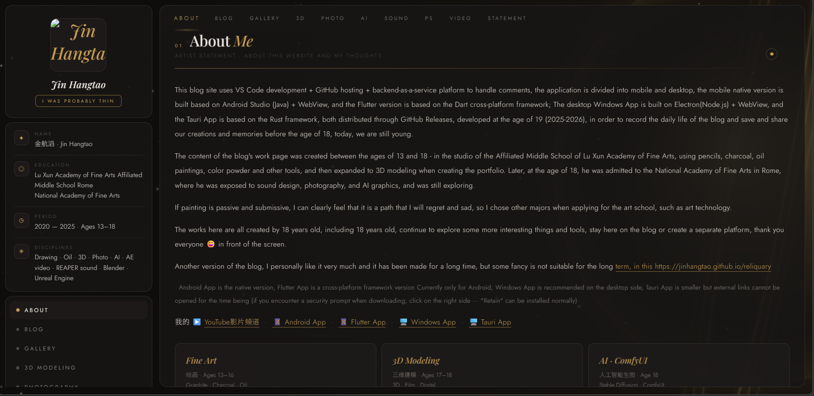

# Jin Hangtao

[-c49a52?style=for-the-badge&logo=threedotjs&logoColor=white)](https://github.com/JinHangtao/reliquary)

Welcome to my blog and memories of me 🚀✨🪐

A personal space for artwork, writing, and things I want to remember.
This site exists because I wanted to keep something before it disappears.
Created in 2026, age 19 — a space to share everyday thoughts and preserve the work and memories made before eighteen.

---

## Sections

| | |
|---|---|
| 📝 **Blog** | Writing, thoughts, daily records |
| 🎨 **Gallery** | Drawing & oil painting |
| 🧊 **3D** | Blender · Unreal Engine |
| 📷 **Photo** | Photography |
| 🤖 **AI** | Stable Diffusion · ComfyUI |
| 🎵 **Sound** | REAPER · sound design |
| ✏️ **PS** | Photoshop works |
| 🎬 **Video** | Digital video · AE |
| 📜 **Statement** | Artist statement |

---

## Tech

---

© Jin Hangtao. All rights reserved.

